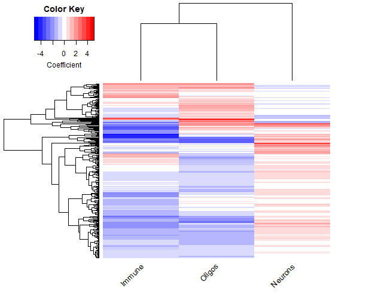
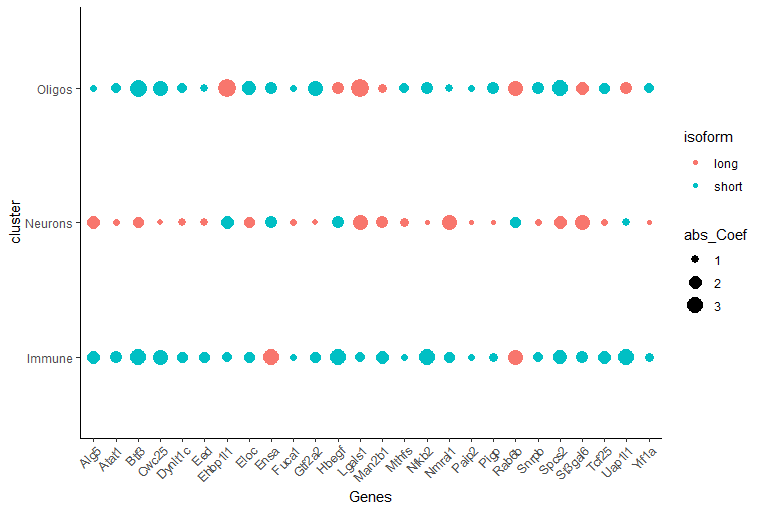

# scMAPA

Alternative polyadenylation (APA) causes shortening or lengthening of the 3ʹ-untranslated region (3ʹ-UTR), widespread in complex tissues. To detect APA and identify cell-type-specific APA in multi-cluster setting, we developed a model-based method, scMAPA. First part of scMAPA is coded as shell scripts, which can 1) divide the aligned read data by the cell cluster; 2) convert BAM to Bedgraph file; 3) estimate the abundance of 3ʹ-UTR long and short isoform of genes in each cluster-bulk data using linear regression and quadratic programming implemented in DaPars. Second part of scMAPA is coded as a R package, which can 4) fit a logistic regression model for each gene and estimate the significance of APA; 5) Identify cluster-specific 3'UTR shortening and lengthening; 6) Do visualization to show the APA dynamics. This vignette introduces the usage of R package part of scMAPA. 

The data used in this example is an intermediate result of analysis on a subset of mouse cortex and midbrain dorsal data. The source of the data could be found here: [Zeisel et al. DOI:https://doi.org/10.1016/j.cell.2018.06.021]

## Load dependencies
Please install the following R packages before using scMAPA: multcomp, lmtest, wec, Matrix.utils, nnet, stringr, gplots, ggplot2, grDevices. 
```{r, echo=TRUE, message=FALSE}
if(!require(devtools)) install.packages("devtools")
require(devtools)
if(!require(scMAPA)) devtools::install_github("ybai3/scMAPA") 
require(scMAPA)
library(multcomp)
library(lmtest)
library(wec)
library(Matrix.utils)
library(nnet)
library(stringr)
library(gplots)
library(ggplot2)
library(scMAPA)
```

## Read in PDUI matrices output from shell scripts

First, we use readin() function to input the PDUI matrices from shell scripts. Path= should be set to the folder containing (only) outputs from DaPars for all samples. NAcutoff refers to the number of NAs among clusters should be tolerated for each gene. For example, if we have 6 clusters, genes with more than NAcutoff=3 of NAs among clusters should be filtered out. Genes with number of NAs <= NAcutoff will remain. 
```{r Load object, echo=TRUE, message=FALSE}
setwd(system.file("extdata", package = "scMAPA", mustWork = T))
a <- readin(path = getwd(), NAcutoff = 1, CPMcutoff = 10)
a[1:5,]
```

                                         Immune_long_exp Immune_short_exp Neurons_long_exp Neurons_short_exp Oligos_long_exp Oligos_short_exp
    ENSMUST00000000327.12|Clec10a|chr11|+             339                0              204                 0              27                0
    ENSMUST00000000449.8|Mkrn2|chr6|+                  21                6              154               173              31               21
    ENSMUST00000000619.7|Clcn4|chr7|-                   1               77               81              1678               9              388
    ENSMUST00000000696.6|Cd52|chr4|-                  288                0              186                 0              29                0
    ENSMUST00000000755.14|Sult5a1|chr8|-               29                0              366                 1              54                1


As shown above, readin() returns filtered isoform specific count matrix. Each cluster has two columns, corresponding to long/short isoforms. All further statistical analysis would be conducted on this matrix.

## Fit model for each gene and estimate gene-level significance of APA

In this example, to save time, we first randomly select 100 genes from 2222 genes. 
```{r}
a <- a[sample(1:nrow(a), 100),]
dim(a)
```

    [1] 2222    6


Then, we use estimateSig() function to estimate gene-level significance of APA. This function estimates significance of APA event at gene level using either model-based approach or test-based approach (argument mode = "model", "test"). Model-based approach will fit a logistic regression model for each gene and estimate significance using Likelihood ratio test. Test-based approach will condunct Fisher's exact test on all possible pairs of clusters (i.e. 1 vs. 2; 1 vs. 3; 2 vs. 3 if 3 clusters) for each gene and use FDR to adjust for multiple-testing issue. Test-based approach defines significant APA genes if they pass significance test in any pair of the clusters. We recommend to use model-based approach since all downstream analyses are based on model-based result.
```{r}
b <- estimateSig(ISOMatrix = a, mode = "model", FDR_P_cutoff = 0.05)
names(b)
```

    [1] "siglist_FDRp"  "ECoeff_Mat"    "ECoeffSig_Mat"

Model-based mode will return a list object containing three elements: 
1. siglist_FDRp contains significant APA event IDs and their gene-level FDR controlled P values.
```{r}
b$siglist_FDRp[1:5]
```

    ENSMUST00000000619.7|Clcn4|chr7|- ENSMUST00000000769.13|Serpinf1|chr11|-   ENSMUST00000000925.9|Smarcb1|chr10|-     ENSMUST00000000985.6|Oxa1l|chr14|+ 
                          4.017108e-02                           8.424570e-51                           3.912039e-31                           6.661349e-03 
       ENSMUST00000001156.7|Cfp|chrX|- 
                          8.211515e-04 
    
2. ECoeff_Mat contains estimated coefficients, P values, and SE from logsitic regression model for all genes. and 3. ECoeffSig_Mat, same matrix but only contains significant APA events. This will be used for identification of cluster-specific APA and visualization. 
```{r}
b$ECoeffSig_Mat[1:3,]
```

                                                                        Genes      Immune.coef   Neurons.coef Oligos.coef   Immune.pval   Neurons.pval  Oligos.pval Immune.se  Neurons.se   Oligos.se
    ENSMUST00000000619.7|Clcn4|chr7|-           ENSMUST00000000619.7|Clcn4|chr7|-   -1.136818     0.176077    -0.556795     2.443141e-01  1.664931e-02  0.05779045   0.9764202  0.07353817   0.2934695
    ENSMUST00000000769.13|Serpinf1|chr11|- ENSMUST00000000769.13|Serpinf1|chr11|-   -3.091410     2.155614     0.650714     4.905856e-26  4.394695e-18  0.23257649   0.2929338  0.24868416   0.5451016
    ENSMUST00000000925.9|Smarcb1|chr10|-     ENSMUST00000000925.9|Smarcb1|chr10|-  -12.564490     5.622854    -14.585091    9.866261e-01  9.851048e-01  0.98447556 749.5591201  301.17936633 749.5589398

## Identify cluster-specific 3' UTR shortening and lengthening

After identifying genes with significant APA dynamics among all clusters, we would like to go one step further to identify the clusters with significantly more or less long isoforms than the across-cluster average for the gene. We call this step as gene-cluster-level identification, it identifies clusters whose estimated regression model coefficient is significantly (FDR < 0.05 using Wald test) and strongly (absolute value of coefficient > log(2), corresponds to 2 fold change in odds ratio) deviated from 0. Both these two parameters could be changed by users.
```{r}
c <- IdentifyClusterAPA(ECoeffSig_Mat = b$ECoeffSig_Mat, FDR_P_cutoff = 0.05, CoeffCutoff = log(2))
names(c)
```

    [1] "Immune"  "Neurons" "Oligos"


As shown above, IdentifyClusterAPA() returns a list consists of tables for every cluster. Tables contain the gene IDs, APA event IDs of 3'UTR shortening or lengthening that passed filters. For example:
```{r}
c$Immune[1:5,]
```

          GeneSymbol         UTR          TranscriptID
    1       Ykt6        lengthening   ENSMUST00000002818.8
    2      Letm1        lengthening   ENSMUST00000005431.5
    3       Neu1        lengthening   ENSMUST00000007253.5
    4      Uchl5        lengthening   ENSMUST00000018333.12
    5        Hn1        lengthening   ENSMUST00000021083.6

## Visualization

To give a overview of APA dynamics, scMAPA can draw heatmap of all gene-cluster-level significant APA events by using clusterAPAheatmap function.
```{r}
clusterAPAheatmap(ECoeffSig_Mat = b$ECoeffSig_Mat, FDR_P_cutoff = 0.05, CoeffCutoff = log(2))
```


The color indicates the degree and direction of 3' UTR processing. In this example, we can observe more 3' UTR lengthening in Neurons comparing to other two cell types. 

Usually, there is a certain set of genes that may play an important role or act as marker for specific cluster. scMAPA could visualize the 3' UTR dynamic of user-defined significant APA. APAgenes parameter in APAdotplot function is not case sensitive. The input to APAgenes parameter should be a character vector consistent with second component of APA event ID (Genes column of ECoeffSig_Mat or siglist_FDRp).
```{r}
APAdotplot(ECoeffSig_Mat = b$ECoeffSig_Mat, FDR_P_cutoff = 0.05, CoeffCutoff = log(2), APAgenes = c("Rab6b","Ensa","Btf3","Hbegf","Yif1a","Fuca1","Man2b1","Paip2",
                                                                                                    "Alg5","Ehbp1l1","Tcf25","Atat1","Nfkb2","Nmral1","Mthfs","Lgals1",
                                                                                                    "Dynlt1c","Uap1l1","Snrpb","Eed","Cwc25","Pigp","St3gal6",
                                                                                                    "Gtf2a2","Eloc","Spcs2"))
```

