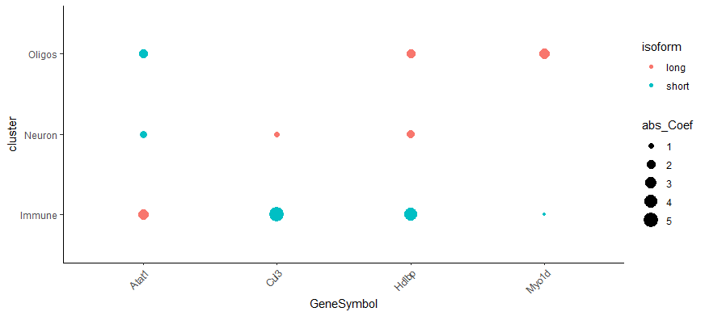

# scMAPA

Alternative polyadenylation (APA) causes shortening or lengthening of the 3ʹ-untranslated region (3ʹ-UTR), widespread in complex tissues. To detect APA and identify cell-type-specific APA in multi-cluster setting, we developed a model-based method, scMAPA. First part of scMAPA is coded as shell scripts, which can 1) divide the aligned read data by the cell cluster[1] and remove PCR duplicates by UMI-tools; 2) Pad the 3'biased reads and convert BAM to Bedgraph file; 3) estimate the abundance of 3ʹ-UTR long and short isoform of genes in each cluster-bulk data using linear regression and quadratic programming implemented in DaPars2. Second part of scMAPA is coded as a R package, which can 4) fit a logistic regression model for each gene and estimate the significance of APA; 5) Identify cluster-specific 3'UTR shortening and lengthening; 6) Do visualization to show the APA dynamics. 

To show the pipeline of scMAPA, we provide mb_example.bam and mb_cluster.csv as example input (https://drive.google.com/drive/folders/1EZThNIKg2VWyJCexTsNI6VJSyikProa8?usp=sharing), which is a downsized mouse brain single-cell RNA sequencing (scRNA-Seq) data. The source of the data could be found here: [Zeisel et al. DOI:https://doi.org/10.1016/j.cell.2018.06.021] In the example data, we only keep three cell clusters: Neurons, Immune cells, and Oligos. 200 cells are kept for each cluster. 

## Part 1 BAM file processing and estimation of long/short isoforms

### Download BAM processing shell scripts
<!-- -->

    git clone https://github.com/ybai3/scMAPA.git
   
There are 3 shell scripts named step1.sh, step2_1.sh and step2_2.sh, step3.sh, corresponding to step 1), 2), and 3), respectively.

### Split BAM files

In this step, step1.sh will call split_bam.py to split BAM files by cell cluster information provided by user. To run step1.sh, please first load Python 3.7 with dependent modules (pysam, csv, sys), and ensure that split_bam.py is in the same folder. Step1.sh takes two positional arguments. The first argument indicates the directory to the file storing cluster information and the second argument indicates the directory to the BAM file.

Cluster information should be stored in a csv file with two columns. First column contains the cell barcodes that match the barcodes in the BAM file. Second columns contains the cluster ID. For example, the first several lines of a cluster csv file should look like: 
```
  Barcode,Cluster
  ACGTGATGAGCGTT-1,Oligos
  ACGACCCTAGACTC-1,Oligos
  ATATAGTGTCACCC-1,Oligos
  AGTCAGACGAGAGC-1,Oligos
  GATCTTTGGTCATG-1,Oligos
  AATCCTACGCATAC-1,Oligos
```
Here is an exmaple of running step1.sh:
```
module load gcc/8.2.0
module load python/bioconda-3.7-2019.03
chmod +x step1.sh
./step1.sh mb_cluster.csv mb_example.bam
```
The BAM file for each cluster will be output to the working directory. 

The Python code used to split BAM file was kindly shared by Dr. Ming Tang at http://doi.org/10.5281/zenodo.3946832. It was originally designed for scATAC Seq and we modified it so that it can be used to split scRNA-Seq BAM files. 

### Padding BAM, PCR duplicates removal and converting to bedgraph

To avoid potential version conflicts between tools called in step2, we split step2 into two bash files. step2_1.sh will be used to remove PCR duplications and step2_2.sh will be used to pad 3'tag reads and convert BAM to BEDGRAPH format. The input to step2_1.sh and step2_2.sh are same, the directory to a folder containing the split BAM files from step 1. Please load samtools, umi-tools for step2_1.sh. Unload all loaded tools and load python 2.7 (we wrote pad3UTRs.py in python2.7 to keep consistent with DaPars2) and pybedtools for step2_2.sh. In addition, please make sure following scripts/files are in the same folder: mm10_m18_refseq_gene_ensembl_extracted_3UTR.sorted.bed and GRCm38.p6.genome.chrom.sizes if sequencing samples are mouse, hg38_v27_refseq_gene_extracted_3UTR_sorted.bed and hg38.chrom.sizes if sequencing samples are human, and the python script pad3UTRs.py.

Here is an example of running step2_1.sh:
```
module load samtools/1.12
module load umi-tools/1.0.0

chmod +x step2_1.sh
./step2_1.sh /path/to/split_bam_files
```
The output will be deduplicated and sorted BAM files. 

Example of running step2_2.sh:
```
module load samtools/1.12
module load pybedtools/0.7.10

chmod +x step2_2.sh
./step2_2.sh /path/to/split_bam_files
```
The output will be padded reads in bedgraph formats. 

### Estimate long/short isoforms

Next we will call DaPars2 developed by Dr. Zheng Xia in the following paper: https://doi.org/10.1038/ncomms6274. We modified the original code so that it will output the estimated counts of long and short isoforms for each cluster. The modified DaPars2 is a python script Dapars2_Multi_Sample_abd.py. Please note that DaPars2 was originally written in Python/2.7. So, please make sure the python loaded for step3.sh is python/2.7.

Step3.sh will call the DaPars2 with following input files: chrIDs.txt, config.txt, and mapping_bam_location_with_depth.txt. chrIDs.txt contains the names of chromosomes that user wants to search for APA event. Please note that the chromosome names should match with names in BAM files. config.txt specifies the location of input files. We recommend to set Coverage_threshold to 1 and do filtering in our R package as it gives more flexibility. For further configure options of DaPars2. Please refer to https://hpc.oit.uci.edu/~leil22/DaPars2_Documentation/DaPars2.html. mapping_bam_location_with_depth.txt contains the number of mapping reads for each split bam. This number can be easily calculated by running samtools view -c -F 4 name.bam. For the example data,
```
echo clusterImmune.dedup.chr.bam
samtools view -c -F 4 clusterImmune.dedup.chr.bam
echo clusterNeurons.dedup.chr.bam
samtools view -c -F 4 clusterNeurons.dedup.chr.bam
echo clusterOligos.dedup.chr.bam
samtools view -c -F 4 clusterOligos.dedup.chr.bam
```
The output would be 
```
clusterImmune.dedup.chr.bam
3122448
clusterNeurons.dedup.chr.bam
9095480
clusterOligos.dedup.chr.bam
7962101
```
User can easily convert the output to mapping_bam_location_with_depth.txt
```
./clusterImmune.dedup.chr.bam.trans.bedgraph    3122448
./clusterNeurons.dedup.chr.bam.trans.bedgraph   7130682
./clusterOligos.dedup.chr.bam.trans.bedgraph    139751314
```
The order of bedgraph in mapping_bam_location_with_depth.txt should be same with the order of bedgraph files in config.txt

To accelerate running speed, user can choose to parallel run all chromosomes instead of using provided step3.sh. The example of parellel run is provided in scMAPA_BAMprocess/run_Dapars2_array.sbatch. 

## Part 2 Model fitting, APA detection, and identification of cluster-specific 3'UTR dynamics

Below is the workflow of running scMAPA R package on the output of step3.sh, which is also provided inside R package in inst/exdata. We only show the default settings of the workflow. For more configuration, user can refer to help page of each R function. 

### Load dependencies

Please install the following R packages before using scMAPA: multcomp, lmtest, wec, Matrix.utils, nnet, stringr, gplots, ggplot2, grDevices. 
```{r, echo=TRUE, message=FALSE}
if(!require(devtools)) install.packages("devtools")
require(devtools)
if(!require(scMAPA)) devtools::install_github("ybai3/scMAPA/scMAPA_RPackage") 
library(multcomp)
library(lmtest)
library(wec)
library(Matrix.utils)
library(nnet)
library(stringr)
library(gplots)
library(ggplot2)
library(AnnotationDbi)
library(org.Mm.eg.db) # if human data, please library(org.Hs.eg.db)
library(scMAPA)
```

### Read in PDUI matrices output from shell scripts

First, we use readinPAsites() function to input the PDUI matrices output from step3.sh. Please put result _result_temp.chrx.txt files in one folder and set argument Path of readinPAsites function to that folder. This folder should contain (only) output files of all chromosomes generated by previous step. NAcutoff refers to the lower limit for number of clusters in which the expression of a gene is detected (not NA). For example, if we have 6 clusters, genes with more than NAcutoff=3 of NAs among clusters should be filtered out. Genes with number of NAs <= NAcutoff will remain. The default value is 3. We can change the column names from samplex to their biological names. The sample names have the same order as the bedgraph files in the config.txt in step 3. 
```{r Load object, echo=TRUE, message=FALSE}
setwd(system.file("extdata", package = "scMAPA", mustWork = T))
ISO_mat <- readinPAsites(path = getwd(), NAcutoff = 3, CPMcutoff_L = 10, CPMcutoff_S = 10, clusterOfInterests = "all")
colnames(ISO_mat) <- str_replace(colnames(ISO_mat), "Sample_1", "Immune")
colnames(ISO_mat) <- str_replace(colnames(ISO_mat), "Sample_2", "Neuron")
colnames(ISO_mat) <- str_replace(colnames(ISO_mat), "Sample_3", "Oligos")
ISO_mat[1:3,1:4]
```

```
                                                                                             Immune_long_exp Immune_short_exp Neuron_long_exp Neuron_short_exp
ENSMUST00000027634.12|ENSMUST00000151708.2|ENSMUST00000112648.7|ENSMUSG00000026385.16|chr1|-            1075             2036             376              669
ENSMUST00000192001.5|ENSMUST00000048309.11|ENSMUST00000192314.1|ENSMUSG00000041570.14|chr1|-             208               64            2121              398
ENSMUST00000192904.1|ENSMUSG00000104524.1|chr1|-                                                           4              256             131              256
```

As shown above, readinPAsites() returns filtered isoform specific count matrix. Each cluster has two columns, corresponding to long/short isoforms. All further statistical analysis would be conducted on this matrix. 

### Fit model for each gene and estimate gene-level significance of APA

Next, we use APAtest() function to estimate gene-level significance of APA. This function estimates significance of APA event at gene level. It will fit a logistic regression model for each gene and estimate significance using Likelihood ratio test. 
```{r}
APAgene <- APAtest(countMatrix = ISO_mat, coverageCutoff = 20, ORcutoff = 0.25, adPval = 0.05)
APAgene[1:3,1:5]
```

```

                                                                                               pvalue_LRT pval_LRT.adjusted Genes Immune.coef   Neuron.coef Oligos.coef
ENSMUST00000192001.5|ENSMUST00000048309.11|ENSMUST00000192314.1|ENSMUSG00000041570.14|chr1|- 2.488587e-04      3.521953e-04 ENSMUST00000192001.5|ENSMUST00000048309.11|ENSMUST00000192314.1|ENSMUSG00000041570.14|chr1|-  -0.4709917    0.02354423   1.4638685
ENSMUST00000192904.1|ENSMUSG00000104524.1|chr1|-                                             7.890328e-33      3.516658e-32 ENSMUST00000192904.1|ENSMUSG00000104524.1|chr1|-  -2.1968858    1.29201697   2.4544736
ENSMUST00000043951.9|ENSMUSG00000037351.9|chr1|-                                             4.230664e-23      1.407145e-22 ENSMUST00000043951.9|ENSMUSG00000037351.9|chr1|-  -0.5431560    0.09694786  -0.4625276
```

Model-based mode will return a list object containing three elements: 
1. siglist_FDRp contains significant APA event IDs and their gene-level FDR controlled P values.
```{r}
b$siglist_FDRp[1:5]
```

    ENSMUST00000000619.7|Clcn4|chr7|- ENSMUST00000000769.13|Serpinf1|chr11|-   ENSMUST00000000925.9|Smarcb1|chr10|-     ENSMUST00000000985.6|Oxa1l|chr14|+ 
                          4.017108e-02                           8.424570e-51                           3.912039e-31                           6.661349e-03 
       ENSMUST00000001156.7|Cfp|chrX|- 
                          8.211515e-04 
    
2. ECoeff_Mat contains estimated coefficients, P values, and SE from logsitic regression model for all genes. and 3. ECoeffSig_Mat, same matrix but only contains significant APA events. This will be used for identification of cluster-specific APA and visualization. 
```{r}
b$ECoeffSig_Mat[1:3,]
```
```
                                                                        Genes      Immune.coef   Neurons.coef Oligos.coef   Immune.pval   Neurons.pval  Oligos.pval Immune.se  Neurons.se   Oligos.se
    ENSMUST00000000619.7|Clcn4|chr7|-           ENSMUST00000000619.7|Clcn4|chr7|-   -1.136818     0.176077    -0.556795     2.443141e-01  1.664931e-02  0.05779045   0.9764202  0.07353817   0.2934695
    ENSMUST00000000769.13|Serpinf1|chr11|- ENSMUST00000000769.13|Serpinf1|chr11|-   -3.091410     2.155614     0.650714     4.905856e-26  4.394695e-18  0.23257649   0.2929338  0.24868416   0.5451016
    ENSMUST00000000925.9|Smarcb1|chr10|-     ENSMUST00000000925.9|Smarcb1|chr10|-  -12.564490     5.622854    -14.585091    9.866261e-01  9.851048e-01  0.98447556 749.5591201  301.17936633 749.5589398
```

### Identify cluster-specific 3' UTR shortening and lengthening

After identifying genes with significant APA dynamics among all clusters, we would like to go one step further to identify the clusters with significantly more or less long isoforms than the across-cluster average for the gene. We call this step as gene-cluster-level identification, it identifies clusters whose estimated regression model coefficient is significantly (FDR < 0.05 using Wald test) and strongly (absolute value of coefficient > log(2), corresponds to 2 fold change in odds ratio) deviated from 0. Both these two parameters could be changed by users.
```{r}
c <- IdentifyClusterAPA(ECoeffSig_Mat = b$ECoeffSig_Mat, FDR_P_cutoff = 0.05, CoeffCutoff = log(2))
names(c)
```

    [1] "Immune"  "Neurons" "Oligos"


As shown above, IdentifyClusterAPA() returns a list consists of tables for every cluster. Tables contain the gene IDs, APA event IDs of 3'UTR shortening or lengthening that passed filters. For example:
```{r}
c$Immune[1:5,]
```

          GeneSymbol         UTR          TranscriptID
    1       Ykt6        lengthening   ENSMUST00000002818.8
    2      Letm1        lengthening   ENSMUST00000005431.5
    3       Neu1        lengthening   ENSMUST00000007253.5
    4      Uchl5        lengthening   ENSMUST00000018333.12
    5        Hn1        lengthening   ENSMUST00000021083.6

### Visualization

To give a overview of APA dynamics, scMAPA can draw heatmap of all gene-cluster-level significant APA events by using clusterAPAheatmap function.
```{r}
clusterAPAheatmap(ECoeffSig_Mat = b$ECoeffSig_Mat, FDR_P_cutoff = 0.05, CoeffCutoff = log(2))
```


The color indicates the degree and direction of 3' UTR processing. In this example, we can observe more 3' UTR lengthening in Neurons comparing to other two cell types. 

Usually, there is a certain set of genes that may play an important role or act as marker for specific cluster. scMAPA could visualize the 3' UTR dynamic of user-defined significant APA. APAgenes parameter in APAdotplot function is not case sensitive. The input to APAgenes parameter should be a character vector consistent with second component of APA event ID (Genes column of ECoeffSig_Mat or siglist_FDRp).
```{r}
APAdotplot(ECoeffSig_Mat = b$ECoeffSig_Mat, FDR_P_cutoff = 0.05, CoeffCutoff = log(2), APAgenes = c("Rab6b","Ensa","Btf3","Hbegf","Yif1a","Fuca1","Man2b1","Paip2",
                                                                                                    "Alg5","Ehbp1l1","Tcf25","Atat1","Nfkb2","Nmral1","Mthfs","Lgals1",
                                                                                                    "Dynlt1c","Uap1l1","Snrpb","Eed","Cwc25","Pigp","St3gal6",
                                                                                                    "Gtf2a2","Eloc","Spcs2"))
```

